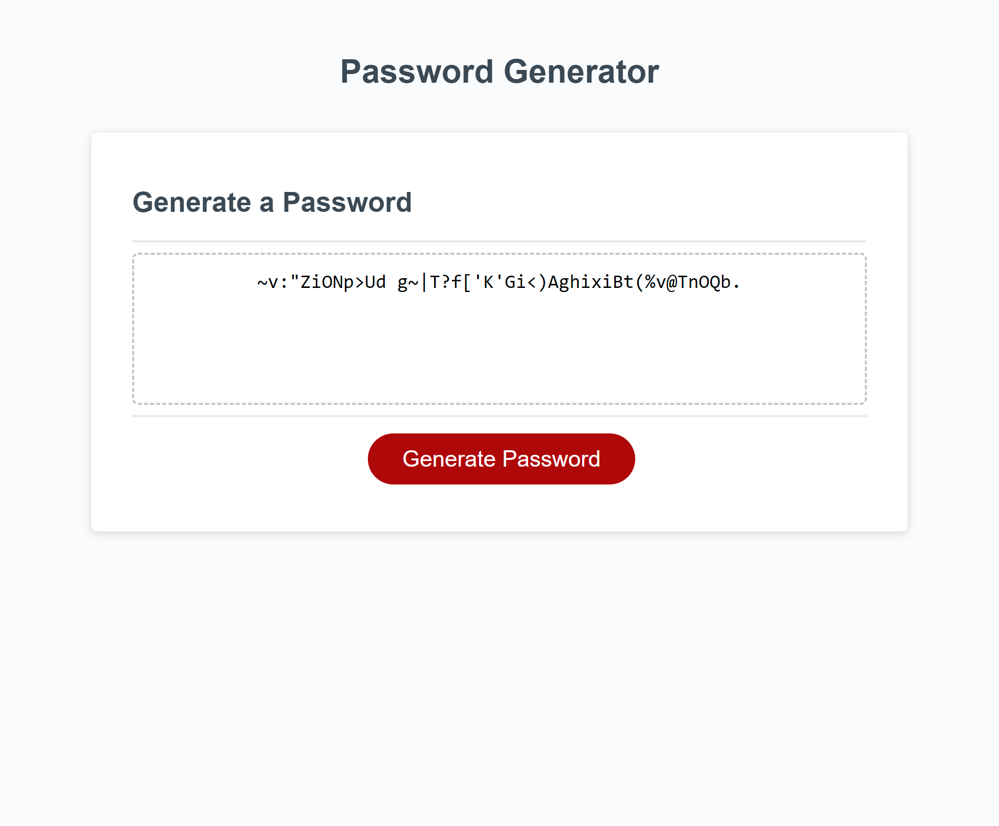

# Roye-Password-Generator

## Description
This repository is designed to showcase fluency in javascript with the creation of a function that generates passwords in a templated html/css document.

## Installation
* Most recent version of VS code

## Usage

Shows an example of proper use of declaring variables, creating for loops, function notation, and interactability with the user involving prompts/alerts/confirmations in javascript.

## Credits

* Rbustan0 (Roye Bustan)
* UCLA Extension Full-Stack Bootcamp (for template)

## License

* MIT license

## Deployment

[Link to Deployed Webpage](https://rbustan0.github.io/Roye-Password-Generator/)  

[Link to Github User](https://github.com/Rbustan0)   

